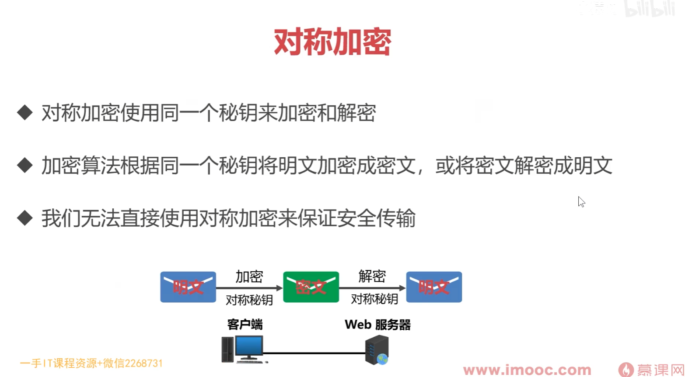
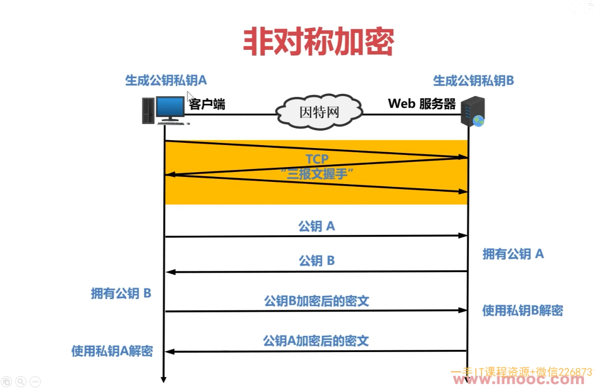
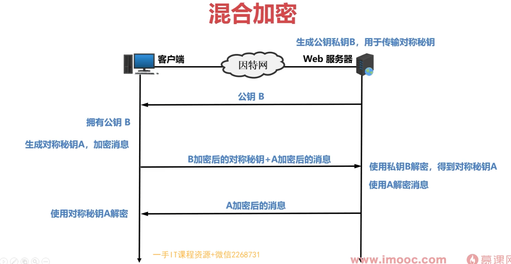
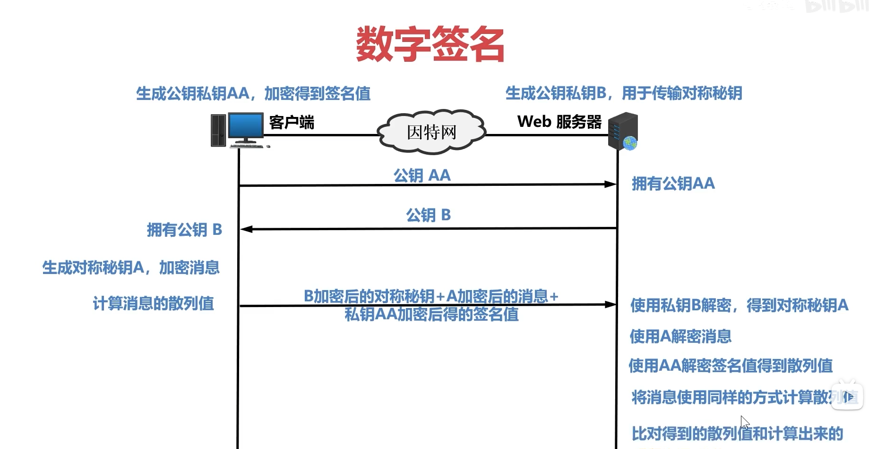
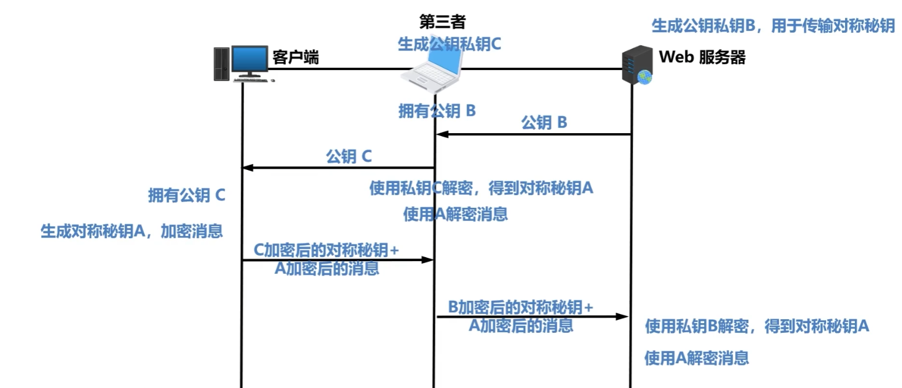

# 3.1 HTTP 常见面试题

- [3.1 HTTP 常见面试题](#31-http-常见面试题)
  - [HTTP 基本概念](#http-基本概念)
    - [HTTP的全称是什么，定义是什么？](#http的全称是什么定义是什么)
    - [HTTP 常见的状态码有哪些？](#http-常见的状态码有哪些)
    - [HTTP 常见字段有哪些？](#http-常见字段有哪些)
  - [GET 与 POST](#get-与-post)
    - [GET 和 POST 有什么区别？](#get-和-post-有什么区别)
  - [HTTP 缓存技术](#http-缓存技术)
    - [HTTP 缓存有哪些实现方式？](#http-缓存有哪些实现方式)
    - [什么是强制缓存？](#什么是强制缓存)
    - [什么是协商缓存？](#什么是协商缓存)
    - [协商缓存有几种实现方式？](#协商缓存有几种实现方式)
    - [协商缓存的实现方式中，谁的优先级更高？为什么？](#协商缓存的实现方式中谁的优先级更高为什么)
    - [请求缓存的整个流程](#请求缓存的整个流程)
  - [HTTP 特性](#http-特性)
    - [HTTP 的优点有哪些？](#http-的优点有哪些)
    - [HTTP 的缺点有哪些？](#http-的缺点有哪些)
    - [HTTP/1.1 的性能如何？](#http11-的性能如何)
  - [HTTP 与 HTTPS](#http-与-https)
    - [HTTP 与 HTTPS 有哪些区别？](#http-与-https-有哪些区别)
    - [HTTPS 解决了 HTTP 的哪些问题？](#https-解决了-http-的哪些问题)
    - [HTTPS  是如何建立连接的？其间交互了什么？](#https--是如何建立连接的其间交互了什么)
    - [HTTPS 的应用数据是如何保证完整性的？](#https-的应用数据是如何保证完整性的)
    - [HTTPS 一定安全可靠吗？](#https-一定安全可靠吗)
  - [HTTP/1.1、HTTP/2、HTTP/3 演变](#http11http2http3-演变)
    - [HTTP/1.1 相比 HTTP/1.0 提高了什么性能？](#http11-相比-http10-提高了什么性能)
    - [HTTP/2 做了什么优化？](#http2-做了什么优化)
    - [HTTP/2 有什么缺陷？](#http2-有什么缺陷)
    - [HTTP/3 做了哪些优化？](#http3-做了哪些优化)
  - [读者问答](#读者问答)


小林我搜集了 6 大类 HTTP 面试常问的题目，同时这 6 大类题跟 **HTTP 的发展和演变**关联性是比较大的，通过**问答 + 图解**的形式**由浅入深**的方式帮助大家进一步的学习和理解 HTTP。

1. HTTP 基本概念
2. Get 与 Post
3. HTTP 特性
4. HTTP 缓存技术
5. HTTPS 与 HTTP
6. HTTP/1.1、HTTP/2、HTTP/3 演变

## HTTP 基本概念

### HTTP的全称是什么，定义是什么？

HTTP 是超文本传输协议，也就是**H**yper**T**ext **T**ransfer **P**rotocol。

**HTTP 是一个在计算机世界里专门在「两点」之间「传输」文字、图片、音频、视频等「超文本」数据的「约定和规范」。**

> 那「HTTP 是用于从互联网服务器传输超文本到本地浏览器的协议」，这种说法正确吗？

这种说法是**不正确**的。因为也可以是「服务器< -- >服务器」，所以采用**两点之间**的描述会更准确。

### HTTP 常见的状态码有哪些？


`1xx` 类状态码属于**提示信息**，是协议处理中的一种中间状态，实际用到的比较少。

- 「**101 Switching Protocols**」协议切换，服务器已经理解了客户端的请求，并将通过 Upgrade 消息头通知客户端采用不同的协议来完成这个请求。比如切换到一个实时且同步的协议（如 WebSocket）以传送利用此类特性的资源。

`2xx` 类状态码表示服务器**成功**处理了客户端的请求，也是我们最愿意看到的状态。

- 「**200 OK**」是最常见的成功状态码，表示一切正常。如果是非 `HEAD` 请求，服务器返回的响应头都会有 body 数据。

- 「**204 No Content**」也是常见的成功状态码，与 200 OK 基本相同，但响应头没有 body 数据。

- 「**206 Partial Content**」是应用于 HTTP 分块下载或断点续传，表示响应返回的 body 数据并不是资源的全部，而是其中的一部分，也是服务器处理成功的状态。

`3xx` 类状态码表示客户端请求的资源发生了变动，需要客户端用新的 URL 重新发送请求获取资源，也就是**重定向**。 

- 「**301 Moved Permanently**」表示永久重定向，说明请求的资源已经不存在了，需改用新的 URL 再次访问。

- 「**302 Found**」表示临时重定向，说明请求的资源还在，但暂时需要用另一个 URL 来访问。

301 和 302 都会在响应头里使用字段 `Location`，指明后续要跳转的 URL，浏览器会自动重定向新的 URL。

- 「**304 Not Modified**」不具有跳转的含义，表示资源未修改，重定向已存在的缓存文件，也称缓存重定向，也就是告诉客户端可以继续使用缓存资源，用于缓存控制。

`4xx` 类状态码表示客户端发送的**报文有误**，服务器无法处理，也就是错误码的含义。

- 「**400 Bad Request**」客户端请求的报文有误。

- 「**403 Forbidden**」服务器禁止访问资源。

- 「**404 Not Found**」服务器上找不到请求资源。

`5xx` 类状态码表示客户端请求报文正确，但是**服务器处理时内部发生了错误**，属于服务器端的错误码。

- 「**500 Internal Server Error**」服务器内部错误。

- 「**501 Not Implemented**」表示客户端请求的功能还不支持。

- 「**502 Bad Gateway**」通常是服务器作为网关或代理时返回的错误码，表示服务器自身工作正常，访问后端服务器发生了错误。

- 「**503 Service Unavailable**」服务器繁忙。

### HTTP 常见字段有哪些？

*Host* 字段：客户端发送请求时，用来指定服务器的域名。

*Connection 字段*：最常用于客户端要求服务器使用「HTTP 长连接」机制，以便其他请求复用。

*Content-Length 字段*：服务器在返回数据时，表明本次回应的数据长度。

>大家应该都知道 HTTP 是基于 TCP 传输协议进行通信的，而使用了 TCP 传输协议，就会存在一个“粘包”的问题，**HTTP 协议通过设置回车符、换行符作为 HTTP header 的边界，通过 Content-Length 字段作为 HTTP body 的边界，这两个方式都是为了解决“粘包”的问题**。具体什么是 TCP 粘包，可以看这篇文章：[如何理解是 TCP 面向字节流协议？](https://xiaolincoding.com/network/3_tcp/tcp_stream.html)

>HTTP 长连接的特点是，只要任意一端没有明确提出断开连接，则保持 TCP 连接状态。    
HTTP/1.1 版本的默认连接都是长连接，但为了兼容老版本的 HTTP，需要指定 `Connection` 首部字段的值为 `Keep-Alive`。
PS：大家不要把 HTTP  Keep-Alive 和 TCP Keepalive 搞混了，这两个虽然长的像，但是不是一个东西，具体可以看我这篇文章：[TCP Keepalive 和 HTTP Keep-Alive 是一个东西吗？](https://xiaolincoding.com/network/3_tcp/tcp_http_keepalive.html)

*Content-Type 字段*：服务器回应时，告诉客户端，本次数据是什么格式。

*Content-Encoding 字段*：说明数据的压缩方法。表示服务器返回的数据使用了什么压缩格式

---

## GET 与 POST

### GET 和 POST 有什么区别？

| 特性       | GET                                                      | POST                                                         |
|------------|-----------------------------------------------------------|--------------------------------------------------------------|
| 用途       | 请求资源或查询数据                                       | 提交数据或创建/更新资源                                     |
| 参数位置   | URL 查询字符串（`?key=value&key=value`）                | 请求体（body）                                               |
| 数据可见性 | 明文显示在 URL 中                                        | 参数在请求体中，不显示在 URL 中                             |
| 长度限制   | 限制较大（一般为 2048 字符）                             | 无限制，可以传输大量数据                                     |
| 缓存       | 可以缓存（浏览器可以缓存 GET 请求）                     | 通常不缓存                                                   |
| 幂等性     | 幂等（多次相同请求产生相同结果）                         | 非幂等（每次请求可能产生不同结果）                           |
| 安全性     | 不适合传递敏感数据（明文传输）                           | 比较安全，但仍需使用 HTTPS 加密通信                         |
| 重复执行   | 支持重复执行（不会产生副作用）                           | 不支持重复执行（可能导致重复操作）                           |
| 使用场景   | 获取资源、查询操作、导航等                               | 提交表单、上传文件、创建/修改数据等                         |


## HTTP 缓存技术

### HTTP 缓存有哪些实现方式？

HTTP 缓存有两种实现方式，分别是**强制缓存和协商缓存**。

### 什么是强制缓存？

只要浏览器判断缓存没有过期，则直接使用浏览器的本地缓存

强缓存是利用下面这两个 HTTP 响应头部（Response Header）字段实现的，它们都用来表示资源在客户端缓存的有效期：

- `Cache-Control`，是一个相对时间；
- `Expires`，是一个绝对时间；

>如果 HTTP 响应头部同时有 Cache-Control 和 Expires 字段的话，**Cache-Control 的优先级高于 Expires** 。

### 什么是协商缓存？

请求响应 `304 Not Modified`，与服务端协商后，告知客户端是否可以使用本地缓存。

### 协商缓存有几种实现方式？

协商缓存可以基于两种头部来实现。

第一种：基于时间

服务器返回资源，响应头中带 `Last-Modified`（表示资源的最后修改时间）  
若强制缓存过期，客户端再次发起请求的时候，请求头中带 `If-Modified-Since`（值是 Last-Modified 的修改时间），服务器拿请求头中的这个值和资源最终的修改时间比较。  
若又有新的修改，则返回新的，否则走缓存

第二种：基于唯一标识

服务器返回资源，响应头中带 `Etag`（响应资源的唯一标识）  
若强制缓存过期，客户端再次发起请求的时候，请求头中带 `If-None-Match`（值是 Etag 的值），服务器拿请求头中的这个值和资源最终的 Etag 值比较。  
若又有新的修改，则返回新的，否则走缓存

### 协商缓存的实现方式中，谁的优先级更高？为什么？

ETag 主要能解决 Last-Modified 几个比较难以解决的问题：

1. 文件内容没变，但最后修改时间可能会改变（比如重复保存操作）  
2. 服务器或文件系统的修改时间粒度通常是秒，秒内多次修改无法区分。

### 请求缓存的整个流程

注意，**协商缓存这两个字段都需要配合强制缓存中 Cache-Control 字段来使用，只有在未能命中强制缓存的时候，才能发起带有协商缓存字段的请求**。

流程图

```text
         用户访问资源
              ↓
 检查强制缓存是否过期（max-age / expires）
              ↓
       ┌─────────────┐   
     没过期         过期      
       ↓             ↓
     用缓存     发协商请求（响应头中带 ETag 或 Last-Modified）
                            ↓
         服务端比较是否修改（请求头中用 If-None-Match 或 If-Modified-Since）
                            ↓
                    ┌───────────────┐
                  未修改          有修改
                    ↓               ↓         
                   304             200 
                继续用缓存        用新资源    

```

## HTTP 特性

###  HTTP 的优点有哪些？

HTTP 最突出的优点是「简单、易扩展、跨平台」。

*1. 简单*

HTTP 基本的报文格式就是 `header + body`，头部信息也是 `key-value` 简单文本的形式。

*2. 易扩展*

HTTP 协议里的各类请求方法、状态码、头字段，都允许开发人员**自定义和扩充**。

同时 HTTP 由于是工作在应用层（ `OSI` 第七层），则它**下层可以随意变化**，比如：

- HTTPS 就是在 HTTP 与 TCP 层之间增加了 SSL/TLS 安全传输层；
- HTTP/1.1 和 HTTP/2.0 传输协议使用的是 TCP 协议，而到了 HTTP/3.0 传输协议改用了 UDP 协议。

*3. 跨平台*

手机、电脑都能用

### HTTP 的缺点有哪些？

HTTP 协议里有优缺点一体的**双刃剑**，分别是「无状态、明文传输」，同时还有一大缺点「不安全」。

*1. 无状态双刃剑*

**好处**：服务器不需要额外的资源去记忆 HTTP 的状态，能减轻服务器的负担。

**坏处**：服务器没有记忆能力，它在完成有关联性的操作时会非常麻烦。  
>例如：登录了淘宝，但后续的加入购物车，仍然需要身份验证，因为浏览器没有记录状态

解决方法：cookie  


*2. 明文传输双刃剑*

**好处**：明文传输的信息，方便阅读和程序调试  

**坏处**：容易泄露隐私

*3. 不安全*

HTTP 比较严重的缺点就是不安全：网络窃听、页面篡改、网站冒充

HTTP 的安全问题，可以用 HTTPS 的方式解决，也就是在 HTTP 和 TCP 层之间引入 SSL/TLS 层。

###  HTTP/1.1 的性能如何？

HTTP 协议是基于 **TCP/IP**，并且使用了「**请求 - 应答**」的通信模式，所以性能的关键就在这**两点**里。

*1. 长连接*

早期 HTTP/1.0 性能上的一个很大的问题，那就是每发起一个请求，都要新建一次 TCP 连接（三次握手），而且是串行请求，通信开销大。

持久连接（长连接）：只要任意一端没有明确提出断开连接，则保持 TCP 连接状态。当然若长时间没有任何数据交互，服务端就会主动断开这个连接。


*2. 管道网络传输*

HTTP/1.1 采用了长连接的方式，这使得管道（pipeline）网络传输成为了可能。

若客户端需要请求两个资源。以前，在同一个 TCP 连接里面，先发送 A 请求，然后等待服务器做出回应，收到后再发出 B 请求；管道机制允许浏览器同时发出 A 请求和 B 请求。


但是**服务器必须按照接收请求的顺序依次发送对这些管道化请求的响应**，若某一个响应卡住，后续的都会卡住。所以，**HTTP/1.1 管道解决了请求的队头阻塞，但是没有解决响应的队头阻塞**。

**注意!!!** 但实际上 HTTP/1.1 管道化技术不是默认开启的，没有被广泛使用


*3. 队头阻塞* 

「请求 - 应答」的模式加剧了 HTTP 的性能问题。

因为当顺序发送的请求序列中的一个请求因为某种原因被阻塞时，在后面排队的所有请求也一同被阻塞了，会招致客户端一直请求不到数据，这也就是「**队头阻塞**」


## HTTP 与 HTTPS

### HTTP 与 HTTPS 有哪些区别？

- HTTP 是明文传输，存在安全风险的问题。HTTPS 在 TCP 和 HTTP 网络层之间加入了 SSL/TLS 安全协议，使得报文能够加密传输。

- HTTP 连接建立简单，TCP 三次握手之后便可进行 HTTP 的报文传输。而 HTTPS 在 TCP 三次握手之后，还需进行 SSL/TLS 的握手，才可进入加密报文传输。

- HTTP 默认端口号是 80，HTTPS 默认端口号是 443。

- HTTPS 协议需要向 CA（证书权威机构）申请数字证书，来保证服务器的身份是可信的。

### HTTPS 解决了 HTTP 的哪些问题？

HTTP 由于是明文传输，存在风险：网络窃听、页面篡改、网站冒充


HTTP**S** 在 HTTP 与 TCP 层之间加入了 `SSL/TLS` 协议，可以很好的解决了上述的风险：

> HTTPS 是如何解决上面的三个风险的？

- **混合加密**的方式实现信息的**机密性**，解决了窃听的风险。
- **摘要算法**的方式来实现**完整性**，它能够为数据生成独一无二的「指纹」，指纹用于校验数据的完整性，解决了篡改的风险。
- 将服务器公钥放入到**数字证书**中，解决了冒充的风险。

*1. 混合加密*

通过**混合加密**的方式可以保证信息的**机密性**，解决了窃听的风险。







HTTPS 采用的是**对称加密**和**非对称加密**结合的「混合加密」方式：

- 通信建立前采用**非对称加密**交换「会话秘钥」。
- 通信过程中使用**对称加密**的「会话秘钥」加密明文数据。

采用「混合加密」的方式的原因：

- **对称加密**只使用一个密钥，运算速度快，密钥必须保密，无法做到安全的密钥交换。
- **非对称加密**使用两个密钥：公钥和私钥，公钥可以任意分发而私钥保密，解决了密钥交换问题但速度慢。

*2. 摘要算法 + 数字签名*

发送方发送数据时，附带发送一个内容的「指纹」；接收方对收到的内容也计算出一个「指纹」，两者进行对比，判断内容是否被篡改

>在计算机里会**用摘要算法（哈希函数）来计算出内容的哈希值**，也就是内容的「指纹」，这个**哈希值是唯一的，且无法通过哈希值反推内容**。

通过哈希算法可以确保内容不会被篡改，**但是并不能避免「内容 + 哈希值」整套被中间人替换，因为这里缺少对客户端收到的消息是否来源于服务端的证明**。

那为了避免这种情况，计算机里会用**非对称加密算法**来解决，共有两个密钥：

- 一个是公钥，这个是可以公开给所有人的；
- 一个是私钥，这个必须由本人管理，不可泄露。

>这两个密钥可以**双向加解密**的，比如可以用公钥加密内容，然后用私钥解密，也可以用私钥加密内容，公钥解密内容。流程不同，目的不同：  
>- **公钥加密，私钥解密**。这个目的是为了**保证内容传输的安全**，因为被公钥加密的内容，其他人是无法解密的，只有持有私钥的人，才能解密出实际的内容；
>- **私钥加密，公钥解密**。这个目的是为了**保证消息不会被冒充**，因为私钥是不可泄露的，如果公钥能正常解密出私钥加密的内容，就能证明这个消息是来源于持有私钥身份的人发送的。

一般我们不会用非对称加密来加密实际的传输内容，因为非对称加密的计算比较耗费性能的。所以非对称加密的用途主要在于**通过「私钥加密，公钥解密」的方式，来确认消息的身份**，我们常说的**数字签名算法**，就是用的是这种方式，不过私钥加密内容不是内容本身，而是**对内容的哈希值加密**。

私钥是由服务端保管，然后服务端会向客户端颁发对应的公钥。如果客户端收到的信息，能被公钥解密，就说明该消息是由服务器发送的。

引入了数字签名算法后，你就无法模仿你爸爸的字迹来请假了，你爸爸手上持有着私钥，你老师持有着公钥。



*3. 数字证书*

前面我们知道：

- 可以通过哈希算法来保证消息的完整性；
- 可以通过数字签名来保证消息的来源可靠性（能确认消息是由持有私钥的一方发送的）；

但是这还远远不够，**还缺少身份验证的环节**，万一公钥是被伪造的呢？



CA（数字证书认证机构），将服务器公钥放在数字证书（由数字证书认证机构颁发）中，只要证书是可信的，公钥就是可信的。

数字证书的工作流程，我也画了一张图，方便大家理解：


通过数字证书的方式保证服务器公钥的身份，解决冒充的风险。

### HTTPS  是如何建立连接的？其间交互了什么？

SSL/TLS 协议基本流程：

- 客户端向服务器索要并验证服务器的公钥。
- 双方协商生产「会话秘钥」。
- 双方采用「会话秘钥」进行加密通信。

前两步也就是 SSL/TLS 的建立过程，也就是 TLS 握手阶段。

TLS 的「握手阶段」涉及**四次**通信，使用不同的密钥交换算法，TLS 握手流程也会不一样的，现在常用的密钥交换算法有两种：[RSA 算法](https://xiaolincoding.com/network/2_http/https_rsa.html) 和 [ECDHE 算法](https://xiaolincoding.com/network/2_http/https_ecdhe.html)。

基于 RSA 算法的 TLS 握手过程比较容易理解，所以这里先用这个给大家展示 TLS 握手过程，如下图：


TLS 协议建立的详细流程：

*1. ClientHello*

首先，由客户端向服务器发起加密通信请求，也就是 `ClientHello` 请求。

客户端主要向服务器发送：客户端支持的 TLS 协议版本、加密算法、客户端生成的随机数（`Client Random`）。

*2. SeverHello*

服务器收到客户端请求后，向客户端发出响应，也就是 `ServerHello`。服务器回应的内容有：确认 TLS 协议版本、加密算法、服务器成的随机数（`Server Random`）和 服务器的数字证书（包含公钥）。

*3.客户端回应*

客户端收到服务器的回应之后，首先通过浏览器或者操作系统中的 CA 公钥，确认服务器的数字证书的真实性（是否由受信任的 CA 签发、在有效期内、证书中的域名是否与访问的域名一致）

如果证书没有问题，客户端会**从数字证书中取出服务器的公钥**，向服务器发送如下信息：

（1）一个被服务器公钥加密的随机数（`pre-master key`）。

（2）加密通信算法改变通知，表示随后的信息都将用「会话秘钥」加密通信。

（3）客户端握手结束通知，表示客户端的握手阶段已经结束。这一项同时把之前所有内容的发生的数据做个摘要，用来供服务端校验。

**服务器和客户端有了这三个随机数（Client Random、Server Random、pre-master key），接着就用双方协商的加密算法，各自生成本次通信的「会话秘钥」**。

*4. 服务器的最后回应*

服务器向客户端发送最后的信息：

（1）加密通信算法改变通知，表示随后的信息都将用「会话秘钥」加密通信。

（2）服务器握手结束通知，表示服务器的握手阶段已经结束。这一项同时把之前所有内容的发生的数据做个摘要，用来供客户端校验。

至此，整个 TLS 的握手阶段全部结束。接下来，客户端与服务器进入 对称加密 通讯。


>如果想深入学习基于 RSA 算法的 HTTPS 握手过程，可以看这篇，我通过抓包的方式，逐步分析每一个过程：[HTTPS RSA 握手解析](https://xiaolincoding.com/network/2_http/https_rsa.html)  
>不过，基于 RSA 算法的 HTTPS 存在「前向安全」的问题：如果服务端的私钥泄漏了，过去被第三方截获的所有 TLS 通讯密文都会被破解。  
>为了解决这个问题，后面就出现了 ECDHE 密钥协商算法，我们现在大多数网站使用的正是 ECDHE 密钥协商算法，关于 ECDHE 握手的过程可以看这篇文章：[HTTPS ECDHE 握手解析](https://xiaolincoding.com/network/2_http/https_ecdhe.html#%E7%A6%BB%E6%95%A3%E5%AF%B9%E6%95%B0)


### HTTPS 的应用数据是如何保证完整性的？

TLS 在实现上分为**握手协议**和**记录协议**两层：

- TLS 握手协议，负责协商加密算法和生成对称密钥，后续用此密钥来保护通讯数据；
- TLS 记录协议，负责保护通讯数据并验证其完整性和来源，所以对 HTTP 数据加密是使用记录协议；

TLS 记录协议主要负责消息（HTTP 数据）的压缩，加密及数据的认证，过程如下图：


具体过程如下：

- 首先，消息被分割成多个较短的片段，然后分别对每个片段进行压缩。

- 接下来，经过压缩的片段会被**加上消息认证码（MAC 值，这个是通过哈希算法生成的），这是为了保证完整性，并进行数据的认证**。通过附加消息认证码的 MAC 值，可以识别出篡改。与此同时，为了防止重放攻击，在计算消息认证码时，还加上了片段的编码。

- 再接下来，经过压缩的片段再加上消息认证码会一起通过对称密码进行加密。

- 最后，上述经过加密的数据再加上由数据类型、版本号、压缩后的长度组成的报头就是最终的报文数据。

记录协议完成后，最终的报文数据将传递到传输控制协议 (TCP) 层进行传输。

如果你想详细了解记录协议是如何分片、压缩、计算 MAC 值、分组加密，可以看这篇：[理解 SSL/TLS 系列 (四) 记录协议](https://blog.csdn.net/zhanyiwp/article/details/105627799)

### HTTPS 一定安全可靠吗？

之前有读者在字节面试的时候，被问到：**HTTPS 一定安全可靠吗？**

这个问题的场景是这样的：客户端通过浏览器向服务端发起 HTTPS 请求时，被「假基站」转发到了一个「中间人服务器」，于是客户端是和「中间人服务器」完成了 TLS 握手，然后这个「中间人服务器」再与真正的服务端完成 TLS 握手。


具体过程如下：

- 客户端向服务端发起 HTTPS 建立连接请求时，然后被「假基站」转发到了一个「中间人服务器」，接着中间人向服务端发起 HTTPS 建立连接请求，此时客户端与中间人进行 TLS 握手，中间人与服务端进行 TLS 握手；
- 在客户端与中间人进行 TLS 握手过程中，中间人会发送自己的公钥证书给客户端，**客户端验证证书的真伪**，然后从证书拿到公钥，并生成一个随机数，用公钥加密随机数发送给中间人，中间人使用私钥解密，得到随机数，此时双方都有随机数，然后通过算法生成对称加密密钥（A），后续客户端与中间人通信就用这个对称加密密钥来加密数据了。
- 在中间人与服务端进行 TLS 握手过程中，服务端会发送从 CA 机构签发的公钥证书给中间人，从证书拿到公钥，并生成一个随机数，用公钥加密随机数发送给服务端，服务端使用私钥解密，得到随机数，此时双方都有随机数，然后通过算法生成对称加密密钥（B），后续中间人与服务端通信就用这个对称加密密钥来加密数据了。
- 后续的通信过程中，中间人用对称加密密钥（A）解密客户端的 HTTPS 请求的数据，然后用对称加密密钥（B）加密 HTTPS 请求后，转发给服务端，接着服务端发送 HTTPS 响应数据给中间人，中间人用对称加密密钥（B）解密 HTTPS 响应数据，然后再用对称加密密钥（A）加密后，转发给客户端。

从客户端的角度看，其实并不知道网络中存在中间人服务器这个角色。那么中间人就可以解开浏览器发起的 HTTPS 请求里的数据，也可以解开服务端响应给浏览器的 HTTPS 响应数据。相当于，中间人能够“偷看”浏览器与服务端之间的 HTTPS 请求和响应的数据。

但是要发生这种场景是有前提的，前提是用户点击接受了中间人服务器的证书。

中间人服务器与客户端在 TLS 握手过程中，实际上发送了自己伪造的证书给浏览器，而这个伪造的证书是能被浏览器（客户端）识别出是非法的，于是就会提醒用户该证书存在问题。


如果用户执意点击「继续浏览此网站」，相当于用户接受了中间人伪造的证书，那么后续整个 HTTPS 通信都能被中间人监听了。

所以，这其实并不能说 HTTPS 不够安全，毕竟浏览器都已经提示证书有问题了，如果用户坚决要访问，那不能怪 HTTPS，得怪自己手贱。

另外，如果你的电脑中毒了，被恶意导入了中间人的根证书，那么在验证中间人的证书的时候，由于你操作系统信任了中间人的根证书，那么等同于中间人的证书是合法的，这种情况下，浏览器是不会弹出证书存在问题的风险提醒的。

这其实也不关 HTTPS 的事情，是你电脑中毒了才导致 HTTPS 数据被中间人劫持的。

所以，**HTTPS 协议本身到目前为止还是没有任何漏洞的，即使你成功进行中间人攻击，本质上是利用了客户端的漏洞（用户点击继续访问或者被恶意导入伪造的根证书），并不是 HTTPS 不够安全**。

> 为什么抓包工具能截取 HTTPS 数据？

很多抓包工具 之所以可以明文看到 HTTPS 数据，工作原理与中间人一致的。

对于 HTTPS 连接来说，中间人要满足以下两点，才能实现真正的明文代理：

1. 中间人，作为客户端与真实服务端建立连接这一步不会有问题，因为服务端不会校验客户端的身份；
2. 中间人，作为服务端与真实客户端建立连接，这里会有客户端信任服务端的问题，也就是服务端必须有对应域名的私钥；

中间人要拿到私钥只能通过如下方式：

1. 去网站服务端拿到私钥；
2. 去 CA 处拿域名签发私钥；
3. 自己签发受浏览器信任的证书；

不用解释，抓包工具只能使用第三种方式取得中间人的身份。

因此使用抓包工具进行 HTTPS 抓包的时候，抓包工具会生成根证书，导入到客户端系统的 受信任的根证书列表 中，这里的根证书实际上起认证中心（CA）的作用。  

随后抓包工具使用该根证书签发域名的证书，因为根证书受信任，域名的证书同样会被浏览器信任。也就是抓包工具给自己创建了一个认证中心 CA，客户端拿着中间人（抓包工具）签发的证书去中间人（抓包工具）自己的 CA 做认证，这个证书当然被认为是有效的。  

> 如何避免被中间人抓取数据？

我们要保证自己电脑的安全，不要被病毒乘虚而入，而且也不要点击任何证书非法的网站，这样 HTTPS 数据就不会被中间人截取到了。

当然，我们还可以通过 **HTTPS 双向认证**来避免这种问题。

一般我们的 HTTPS 是单向认证，客户端只会验证了服务端的身份，但是服务端并不会验证客户端的身份。


如果用了双向认证方式，不仅客户端会验证服务端的身份，而且服务端也会验证客户端的身份。服务端一旦验证到请求自己的客户端为不可信任的，服务端就拒绝继续通信，客户端如果发现服务端为不可信任的，那么也中止通信。

## HTTP/1.1、HTTP/2、HTTP/3 演变

### HTTP/1.1 相比 HTTP/1.0 提高了什么性能？

HTTP/1.1 相比 HTTP/1.0 性能上的改进：

- 使用长连接，多个请求可以复用同一个TCP连接，改善了 HTTP/1.0 短连接造成的性能开销。
- 支持管道（pipeline）网络传输，只要第一个请求发出去了，不必等其回来，就可以发第二个请求出去，可以减少整体的响应时间。


但 HTTP/1.1 还是有性能瓶颈：

- 请求 / 响应头部（Header）未经压缩就发送，首部信息越多延迟越大。只能压缩 `Body` 的部分；
- 发送冗长的头部。每次互相发送相同的头部造成浪费；
- 服务器是按请求的顺序响应的，如果服务器响应慢，会招致客户端一直请求不到数据，也就是队头阻塞；
- 没有请求优先级控制；
- 请求只能从客户端开始，服务器只能被动响应。

### HTTP/2 做了什么优化？

HTTP/2 协议是基于 HTTPS 的，所以 HTTP/2 的安全性也是有保障的。


那 HTTP/2 相比 HTTP/1.1 性能上的改进：

- 头部压缩
- 二进制格式
- 并发传输
- 服务器主动推送资源

*1. 头部压缩*

HTTP/2 会**压缩头**（Header）如果你同时发出多个请求，他们的头是一样的或是相似的，那么，协议会帮你**消除重复的部分**。

这就是所谓的 `HPACK` 算法：在客户端和服务器同时维护一张头信息表，所有字段都会存入这个表，生成一个索引号，以后就不发送同样字段了，只发送索引号，这样就**提高速度**了。

*2. 二进制格式*

HTTP/2 不再像 HTTP/1.1 里的纯文本形式的报文，而是全面采用了**二进制帧格式**，头信息和数据体都是二进制，并且统称为帧（frame）：**头信息帧（Headers Frame）和数据帧（Data Frame）**。大大减小了传输量

*3. 并发传输*

虽然 HTTP/1.1 是长连接(多个请求可以复用同一个TCP连接)，但每个连接仍然是顺序处理请求的，浏览器仍然必须按顺序发送请求并等待响应返回后再发送下一个请求，中间某个响应卡住，容易造成了**队头阻塞**。

HTTP/2.0 在同一TCP连接上可以同时传输多个 请求和响应(stream)。

**不同的 HTTP 请求用独一无二的 Stream ID 来区分，接收端可以通过 Stream ID 有序组装成 HTTP 消息，不同 Stream 的帧是可以乱序发送的，因此可以并发不同的 Strem**。


*4、服务器推送*

HTTP/2 可以在客户端请求一个资源时，将其他相关资源一并推送给客户端，从而减少了客户端的请求次数和延迟

>客户端和服务器**双方都可以建立 Stream**，Stream ID 也是有区别的，客户端建立的 Stream 必须是奇数号，而服务器建立的 Stream 必须是偶数号。


### HTTP/2 有什么缺陷？

HTTP/2 通过 Stream 的并发能力，解决了 HTTP/1 队头阻塞的问题，但是 HTTP/2 还是存在“队头阻塞”的问题，只不过问题不是在 HTTP 这一层面，而是在 TCP 这一层。

**HTTP/2 是基于 TCP 协议来传输数据的，TCP 是字节流协议，TCP 层必须保证收到的字节数据是完整且连续的，这样内核才会将缓冲区里的数据返回给 HTTP 应用，那么当「前 1 个字节数据」没有到达时，后收到的字节数据只能存放在内核缓冲区里，只有等到这 1 个字节数据到达时，HTTP/2 应用层才能从内核中拿到数据，这就是 HTTP/2 队头阻塞问题。**

所以，一旦发生了丢包现象，就会触发 TCP 的重传机制，这样在一个 TCP 连接中的**所有的 HTTP 请求都必须等待这个丢了的包被重传回来**。

### HTTP/3 做了哪些优化？

前面我们知道了 HTTP/1.1 和 HTTP/2 都有队头阻塞的问题：

- HTTP/1.1 中的管道（pipeline）虽然解决了请求的队头阻塞，但是**没有解决响应的队头阻塞**，因为服务端需要按顺序响应收到的请求，如果服务端处理某个请求消耗的时间比较长，那么只能等响应完这个请求后，才能处理下一个请求，这属于 HTTP 层队头阻塞。
- HTTP/2 虽然通过多个请求复用一个 TCP 连接解决了 HTTP 的队头阻塞，但是**一旦发生丢包，就会阻塞住所有的 HTTP 请求**，这属于 TCP 层队头阻塞。

HTTP/2 队头阻塞的问题是因为 TCP，所以 **HTTP/3 把 HTTP 下层的 TCP 协议改成了 UDP！**


UDP 发送是不管顺序，也不管丢包的，所以不会出现像 HTTP/2 队头阻塞的问题。大家都知道 UDP 是不可靠传输的，但基于 UDP 的 **QUIC 协议** 可以实现类似 TCP 的可靠性传输。

QUIC 有以下 3 个特点。

- 无队头阻塞
- 更快的连接建立
- 连接迁移

*1、无队头阻塞*

QUIC 协议也有类似 HTTP/2 Stream 与多路复用的概念，也是可以在同一条连接上并发传输多个 Stream，Stream 可以认为就是一条 HTTP 请求。

QUIC 有自己的一套机制可以保证传输的可靠性的。**当某个流发生丢包时，只会阻塞这个流，其他流不会受到影响，因此不存在队头阻塞问题**。这与 HTTP/2 不同，HTTP/2 只要某个流中的数据包丢失了，其他流也会因此受影响。

所以，QUIC 连接上的多个 Stream 之间并没有依赖，都是独立的，某个流发生丢包了，只会影响该流，其他流不受影响。

*2、更快的连接建立*

对于 HTTP/1 和 HTTP/2 协议，TCP 和 TLS 是分层的，分别属于内核实现的传输层、openssl 库实现的表示层，因此它们难以合并在一起，需要分批次来握手，先 TCP 握手，再 TLS 握手。

HTTP/3 在传输数据前虽然需要 QUIC 协议握手，但这个握手过程只需要 1 RTT，握手的目的是为确认双方的「连接 ID」，连接迁移就是基于连接 ID 实现的。

但是 HTTP/3 的 QUIC 协议并不是与 TLS 分层，而是 QUIC 内部包含了 TLS，它在自己的帧会携带 TLS 里的“记录”，再加上 QUIC 使用的是 TLS/1.3，因此仅需 1 个 RTT 就可以「同时」完成建立连接与密钥协商，如下图：


甚至，在第二次连接的时候，应用数据包可以和 QUIC 握手信息（连接信息 + TLS 信息）一起发送，达到 0-RTT 的效果。

如下图右边部分，HTTP/3 当会话恢复时，有效负载数据与第一个数据包一起发送，可以做到 0-RTT（下图的右下角）：


*3、连接迁移*

基于 TCP 传输协议的 HTTP 协议，由于是通过四元组（源 IP、源端口、目的 IP、目的端口）确定一条 TCP 连接。

那么**当移动设备的网络从 4G 切换到 WIFI 时，意味着 IP 地址变化了，那么就必须要断开连接，然后重新建立连接**。而建立连接的过程包含 TCP 三次握手和 TLS 四次握手的时延，以及 TCP 慢启动的减速过程，给用户的感觉就是网络突然卡顿了一下，因此连接的迁移成本是很高的。

而 QUIC 协议没有用四元组的方式来“绑定”连接，而是通过**连接 ID** 来标记通信的两个端点，客户端和服务器可以各自选择一组 ID 来标记自己，因此即使移动设备的网络变化后，导致 IP 地址变化了，只要仍保有上下文信息（比如连接 ID、TLS 密钥等），就可以“无缝”地复用原连接，消除重连的成本，没有丝毫卡顿感，达到了**连接迁移**的功能。


所以，QUIC 是一个在 UDP 之上的**伪** TCP + TLS + HTTP/2 的多路复用的协议。  
QUIC 是新协议，对于很多网络设备，根本不知道什么是 QUIC，只会当做 UDP，这样会出现新的问题，因为有的网络设备是会丢掉 UDP 包的，而 QUIC 是基于 UDP 实现的，那么如果网络设备无法识别这个是 QUIC 包，那么就会当作 UDP 包，然后被丢弃。


## 读者问答


> 读者问：“https 和 http 相比，就是传输的内容多了对称加密，可以这么理解吗？”

1. 建立连接时候：https 比 http 多了 TLS 的握手过程；

2. 传输内容的时候：https 会把数据进行加密，通常是对称加密数据；

> 读者问：“我看文中 TLS 和 SSL 没有做区分，这两个需要区分吗？”

这俩实际上是一个东西。

SSL 是洋文“*Secure Sockets Layer*”的缩写，中文叫做「安全套接层」。它是在上世纪 90 年代中期，由网景公司设计的。

到了 1999 年，SSL 因为应用广泛，已经成为互联网上的事实标准。IETF 就在那年把 SSL 标准化。标准化之后的名称改为 TLS（是“*Transport Layer Security*”的缩写），中文叫做「传输层安全协议」。

很多相关的文章都把这两者并列称呼（SSL/TLS），因为这两者可以视作同一个东西的不同阶段。

> 读者问：“为啥 SSL 的握手是 4 次？”

SSL/TLS 1.2 需要 4 握手，需要 2 个 RTT 的时延，我文中的图是把每个交互分开画了，实际上把他们合在一起发送，就是 4 次握手：


另外，SSL/TLS 1.3 优化了过程，只需要 1 个 RTT 往返时延，也就是只需要 3 次握手：


